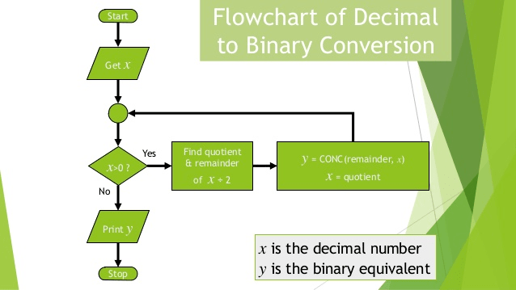
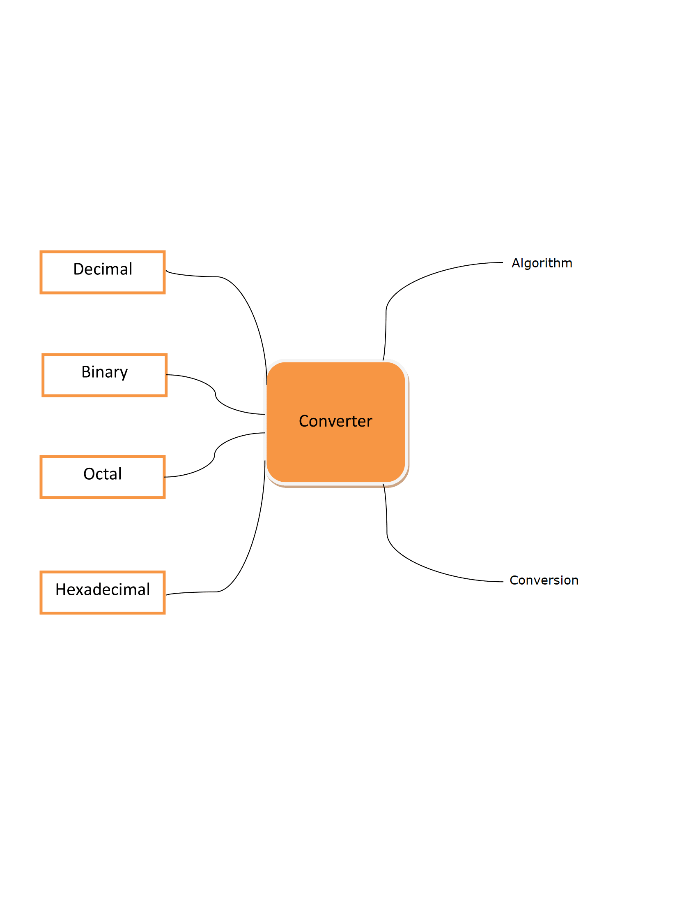

## Storyboard (Round 2)

Delete this line before submission : The core principle of Round 2 is to make the lab/experiment documentation elaborated in a manner that it makes easy for any person (developer/domain and non domain faculty/student) to understand and develop the lab/experiment.

Experiment 1: Number System Conversion

### 1. Story Outline:

The experiment is based on number system conversion.Student approaches the simulator to understand the concept of conversion.The main objective of the experiment is to convert the decimal to binary,octal and hexadecimal. By performing this experiment, the student is able to understand the concept of conversion and also get deep knowledge.

### 2. Story:

<b>Number System: </b>A number system is a writing system for expressing numbers; that is, a mathematical notation for representing numbers of a given set, using digits or other symbols in a consistent manner. The same sequence of symbols may represent different numbers in different numeral systems.The number system or the numeral system is the system of naming or representing numbers. There are various types of number systems in maths like binary, decimal, etc. 

<b>Decimal Number System: </b>The decimal numeral system is the standard system for denoting integer and non-integer numbers.It has base 10.
<b>Octal Number System: </b>The octal numeral system, or oct for short, is the base-8 number system, and uses the digits 0 to 7.It has base 8.
<b>Hexadecimal Number System: </b>In mathematics and computing, hexadecimal is a positional system that represents numbers using a base of 16. Unlike the common way of representing numbers with ten symbols, it uses sixteen distinct symbols, most often the symbols "0"–"9" to represent values zero to nine, and "A"–"F" to represent values ten to fifteen.

#### 2.1 Set the Visual Stage Description:
The very first text will be Conversion.The simulator will have a block where user has to enter the decimal number.A convert button will be made on which user will click after giving input then the output will display.

#### 2.2 Set User Objectives & Goals:
The aim of the simulator is to convert the decimal number into binary,octal and hexdecimal number at a time. The goal is to understand the conversion concept by each user.

#### 2.3 Set the Pathway Activities:

Describe the pathway activites here : (Guide : Set the pathway activities in line with the learning objectives (LOs)  & with a view to achieve the goals set in round #0 & round#1.  (once he begins, how he will traverse through the entire experiment ? in descriptive))

##### 2.4 Set Challenges and Questions/Complexity/Variations in Questions:

Describe the challenges Here : (guide : Set Challenges and Questions/Complexity/variations in questions according to User’s level, so as to invoke the learners’ interest.  (while traversing, what challenges he will face? how he has to solve and overcome ? descriptive).)

##### 2.5 Allow pitfalls:
Describe the pitfalls here: (guide : (while traversing or while solving challenge, how will we bring a situation in front of him that he commits mistake if he is not attentive , or not following procedure , descriptive))

##### 2.6 Conclusion:
Describe conclusion here : (guide: This may include displaying: how much time did the user take to solve the questions/ How many questions were right?/ How many hints did the learner use. Based on this the evaluation/marking to be suggested to the user. (once he is towards the completion of the experiment, what LO he is taking along with him, what will be his probable, interpretation/conclusion , descriptive) )

##### 2.7 Equations/formulas: NA
Type equations here : (guide : ( a separate sheet having equations / programs for the lab exper3ment to be shared along with the Story submissions (1) . You can mark it as numerical reference numbers within the story narration (like we cite in the research papers) and then separately share these equations/programs sheets as a reference, do not include the equations as a whole in the narration))
Tool can be used to integrate formula in Markdown <b> [here](http://latex.codecogs.com/eqneditor/samples/example3.php) </b>

### 3. Flowchart 4
 
link to flow chart Here : Store in the  /flowchart folder within Round2 folder in your repo
 
(guide :The lab proposer should extract logic from the story, prepare a flowchart from the story narration and write the algorithm to execute the black box.  use Google Drawings https://docs.google.com/drawings/ (send the link to your flowchart and also attach .png by exporting it )

### 4. Mindmap:

 Link to mindmap here : Store the mindmap in both .mm & .png extension in the  /mindmap folder and include link of only .pdf verison here
  
 (guide : An elaborate mind map (connecting all the points in the experiment flow ) should be prepared and submitted by the lab proposer. The mind map should be a clear and detailed document that takes into account all minute intri5acies involved in the development of virtual lab. The mindmap should be self-content and any developer across the globe should be able to code it with all those details. using only FreeMind http://freemind.sourceforge.net/wiki/index.php/Main_Page (send the .png file and also the original .mm extension project file. )

### 5. Storyboard :
Storyboard: <a href="Storyboard/carwiper.gif"> [here]</a>
Link to storybaord (.gif file ) here :
(guide: This document should include sketching and description scene wise (duration, action, description). Software to be used for storyboarding : https://wonderunit.com/storyboarder/ (Its a FOSS tool) . tutorial on how to use it https://www.youtube.com/watch?v=LAeCEpG0KX4
