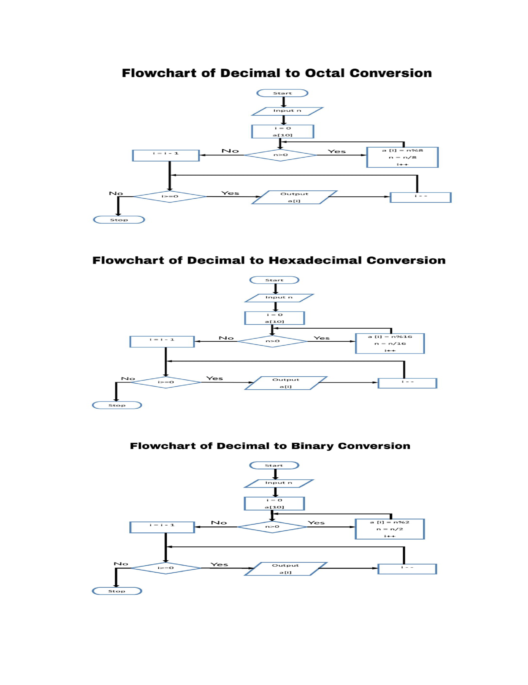

## Storyboard (Round 2)

Experiment 1: Number System Conversion

### 1. Story Outline:

The experiment is based on number system conversion.Student approaches the simulator to understand the concept of conversion.The main objective of the experiment is to convert the decimal to binary,octal and hexadecimal. By performing this experiment, the student is able to understand the concept of conversion and also get deep knowledge.

### 2. Story:

<b>Number System: </b>A number system is a writing system for expressing numbers; that is, a mathematical notation for representing numbers of a given set, using digits or other symbols in a consistent manner. The same sequence of symbols may represent different numbers in different numeral systems.The number system or the numeral system is the system of naming or representing numbers. There are various types of number systems in maths like binary, decimal, etc. 

<b>Decimal Number System: </b>The decimal numeral system is the standard system for denoting integer and non-integer numbers.It has base 10.
<b>Octal Number System: </b>The octal numeral system, or oct for short, is the base-8 number system, and uses the digits 0 to 7.It has base 8.
<b>Hexadecimal Number System: </b>In mathematics and computing, hexadecimal is a positional system that represents numbers using a base of 16. Unlike the common way of representing numbers with ten symbols, it uses sixteen distinct symbols, most often the symbols "0"–"9" to represent values zero to nine, and "A"–"F" to represent values ten to fifteen.

#### 2.1 Set the Visual Stage Description:
The very first text will be Conversion.The simulator will have a block where user has to enter the decimal number.A convert button will be made on which user will click after giving input,the output will display.The reset button will be reset everything.

#### 2.2 Set User Objectives & Goals:
The aim of the simulator is to convert the decimal number into binary,octal and hexdecimal number at a time. The goal is to understand the conversion concept by each user.

#### 2.3 Set the Pathway Activities:
1.Click on the button "Start the simulator".It takes to next screen. 
2.All component of the experiment are seen on the screen. 
3.Enter the decimal number in the block. 
4.Click on convert button.It will give output. 
5.Click on reset button to reset the experiment for next value. 

##### 2.4 Set Challenges and Questions/Complexity/Variations in Questions:
Q.What is base of decimal number system? 
Q.What is the binary number system of 5? 
Q.What will be the decimal value of 'E' hexadecimal number? 
Q.What is the base of hexadecimal number? 
Q.Is 2269 an octal number? 

##### 2.5 Allow pitfalls:
Input must be an integer number only.On entering decimal it will not give desirable ouptut.

##### 2.6 Conclusion:
By the end of this experiment,the student will able to understand the way to convert the decimal number to binary,octal and hexadecimal number.

##### 2.7 Equations/formulas: NA
<b>Decimal to Binary:</b>Divide the number by 2 and write the remainder also in front of each step till number become 1 or 0 then take remainder values and move from botton to top and write it in same manner.  
<b>Decimal to Octal:</b>Divide the number by 8 and write the remainder also in front of each step till number become 1 or 0 then take remainder values and move from botton to top and write it in same manner.  
<b>Decimal to Hexadecimal:</b>Divide the number by 16 and write the remainder also in front of each step till number become 1 or 0.Also remember to convert 10 to 15 number into 'A' to 'F' respectively then take remainder values and move from botton to top and write it in same manner.  

### 3. Flowchart 4
 
link to flow chart Here : Store in the  /flowchart folder within Round2 folder in your repo
 
(guide :The lab proposer should extract logic from the story, prepare a flowchart from the story narration and write the algorithm to execute the black box.  use Google Drawings https://docs.google.com/drawings/ (send the link to your flowchart and also attach .png by exporting it )

### 4. Mindmap:

 Link to mindmap here : Store the mindmap in both .mm & .png extension in the  /mindmap folder and include link of only .pdf verison here
  
 (guide : An elaborate mind map (connecting all the points in the experiment flow ) should be prepared and submitted by the lab proposer. The mind map should be a clear and detailed document that takes into account all minute intri5acies involved in the development of virtual lab. The mindmap should be self-content and any developer across the globe should be able to code it with all those details. using only FreeMind http://freemind.sourceforge.net/wiki/index.php/Main_Page (send the .png file and also the original .mm extension project file. )

### 5. Storyboard :
Storyboard: <a href="Storyboard/carwiper.gif"> [here]</a>
Link to storybaord (.gif file ) here :
(guide: This document should include sketching and description scene wise (duration, action, description). Software to be used for storyboarding : https://wonderunit.com/storyboarder/ (Its a FOSS tool) . tutorial on how to use it https://www.youtube.com/watch?v=LAeCEpG0KX4
